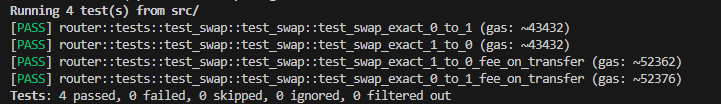

# STARKNET WINTER HACKATHON PROJECT
Starkware hackathon Winner! 🥉 + JediSwap track 🥇

## FoT router for JEDISWAP V1
Proudly introducing the FoT Router for JEDISWAP V1, the first router in the StarkNet ecosystem to handle fee-on-transfer (FoT) tokens, unveiled at the StarkNet Winter Hackathon. This innovation sets a new standard for token swaps, enhancing StarkNet's DeFi landscape.

Efforts to extend this functionality to JEDISWAP V2 are ongoing, though challenges remain. We're dedicated to achieving this milestone.

FoT tokens, or reflective/deflationary tokens, incorporate transaction fees that benefit holders or reduce supply, promising a dynamic token economy. Our router facilitates these tokens' integration, broadening trading possibilities on JEDISWAP.

## Tests
Successfully integrated our fee-on-transfer methods with JEDISWAP's router contract and tested the functionality. These tests also serve as integration tests for our reflections token standard, demonstrating its compatibility with existing DeFi protocols like JEDISWAP. 

For insights into our work with FoT tokens, visit: [here](https://github.com/henryf10h/reflect_cairo).

## Updates
. Implemented fee on transfer functionality in the JediSwap v1 router contract (Cairo 2)
. Added new external function swap_exact_tokens_for_tokens_supporting_fee_on_transfer_tokens and internal helper
. Added test cases test_swap_exact_0_to_1_fee_on_transfer and test_swap_exact_1_to_0_fee_on_transfer

### Findings:
. Swapping fee-on-transfer tokens incurs ~17.1% higher gas costs than standard ERC20 swaps
. swap_exact_tokens_for_tokens_supporting_fee_on_transfer_tokens (fee-on-transfer → ERC20) has ~0.03% higher gas usage than swap_exact_tokens_for_tokens (ERC20 → fee-on-transfer)
. Allows testing optimal way to handle fee-on-transfer token swaps based on gas usage

